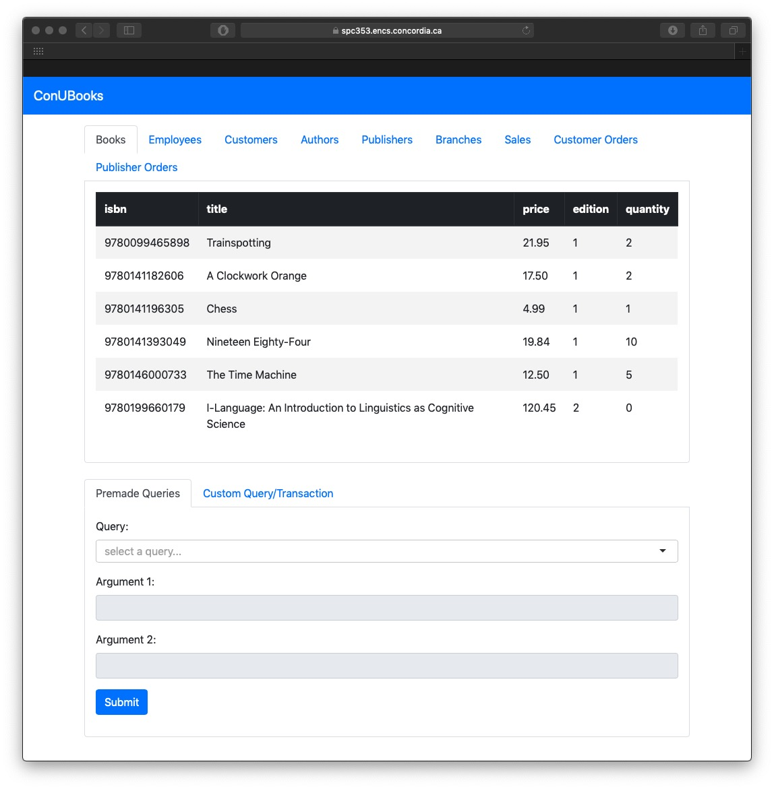
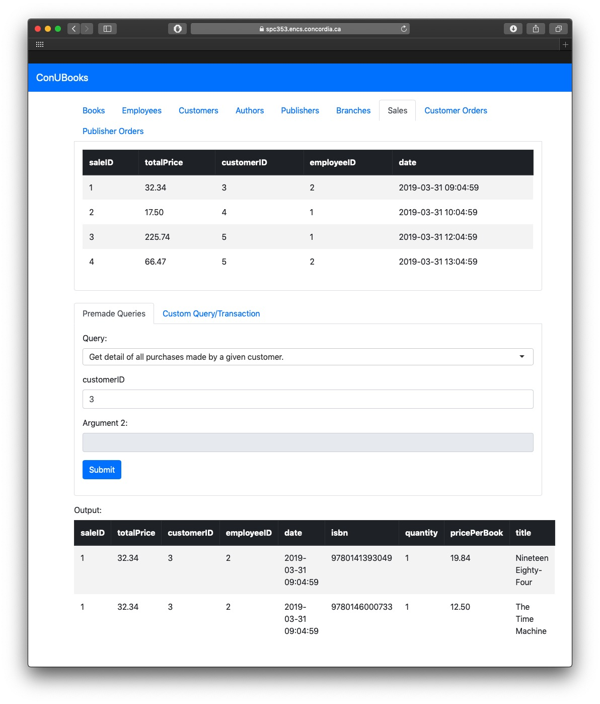
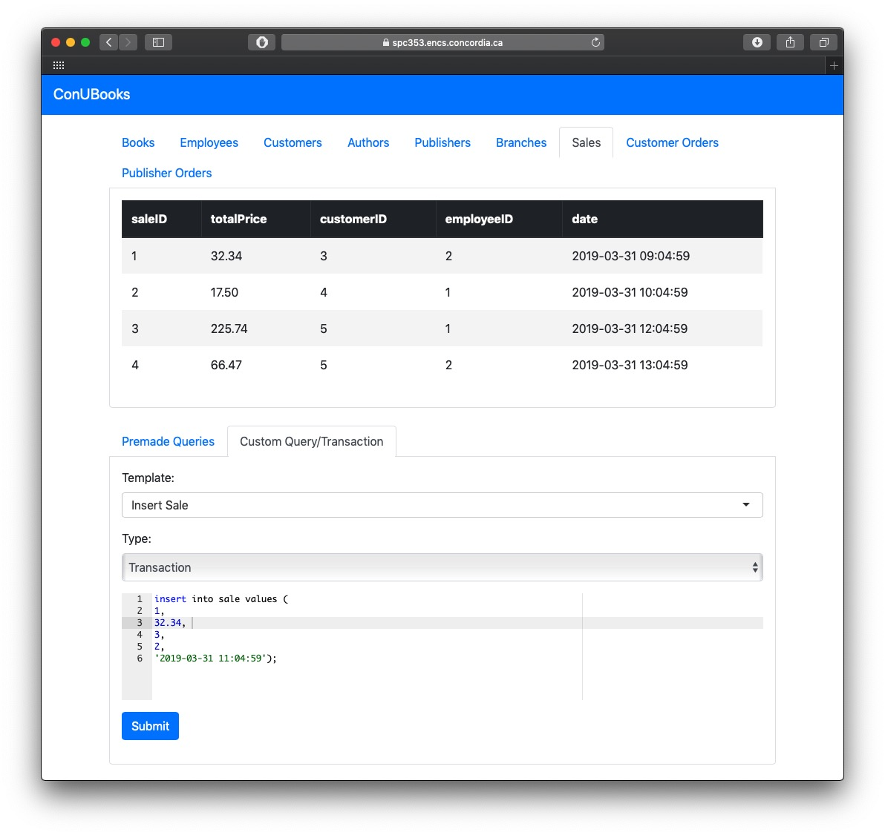
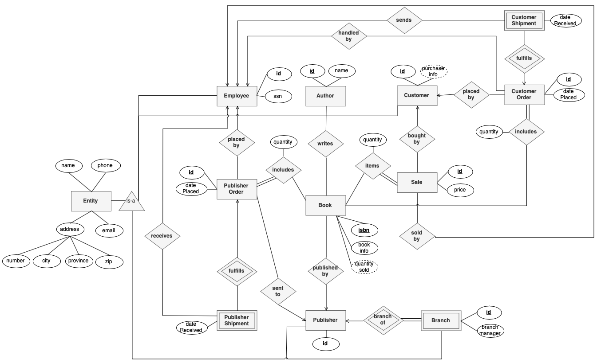

# ConUBooks
Manage inventory, sales and day-to-day operations of a bookstore, a COMP353 Databases project.

### Project URL
[spc353.encs.concordia.ca](https://spc353.encs.concordia.ca)

### Features
Both the E/R Diagram and the database implementation meet all the requirements for the database system. The application allows employees to view and update the bookstore's database, as shown below.

Tables detailing commonly used entities such as *books*, *customers* or *publisher orders* are always present at the top of the page, offering easy access when bookstore employees reference data.



As shown below, several premade queries are included, allowing employees to quickly answer common questions. Here, the employee is inquiring about the purchases made by a given customer, and can see the results of their query.



Everything else, including making a sale, placing publisher orders and updating a customer's address can be done via the editor. The editor can be set in *query* or *transaction* mode, which allows reading or writing to the database. For convenience, templates are offered for common tasks, like placing a publisher order or seeing an author's books.



#### Requirements
See the [project-requirements.pdf](https://github.com/patrickspensieri/ConUBooks/blob/master/requirements/project-requirements.pdf) and the [grading-scheme.pdf](https://github.com/patrickspensieri/ConUBooks/blob/master/requirements/grading-scheme.pdf) files.

#### Possible Improvements
Triggers or procedures can be used to help the employee make a sale, receive publisher shipments, or send out customer shipments. For example,
```SQL
CREATE PROCEDURE processPublisherShipment(
    IN publisherOrderID integer,
    IN employeeID integer)
BEGIN
    -- set the publisherShipment's dateReceived
    -- for each book in the shipment
    -- increase stock count by given quantity
END //
```

### Relational Database Schema
The following scripts build, populate and query the database. To run any of the scripts, establish a connection and run `source /path/to/script.sql`.

#### ER Diagram
All entities that have a *name, phone number, email* and *address* extend the `entity` table.
- Allows an `employee` to make purchases and act as a `customer`.
- `address` is a composite attribute, consisting of *zip*, *civic number* and other fields
- `publisher` and `book` form a one-to-many relation, where one publisher can have many books. One-to-many relations require a mapping table, such as `book_publisher`. The primary key would be `(isbn)`.
- `author` and `book` for a many-to-many relation, where one book can have many authors. Many-to-many relations also require a mapping table, such as `author_book`. The primary key for such tables would be `(isbn, authorID)`.
- `sale` and `customer` form a one-to-one relation, in that a sale is made by a single customer. These relations do not require a mapping table.



#### Schema script
The [schema.sql](https://github.com/patrickspensieri/ConUBooks/blob/master/scripts/schema.sql) script defines the schema for the database. It also defines some procedures, which facilitate insertion of subclassed entities. Cascading deletes are supported for some entities, such as branches, customer orders and publisher orders.

#### Data script
The [data.sql](https://github.com/patrickspensieri/ConUBooks/blob/master/scripts/data.sql) script populates the tables.

#### Queries script
The [queries.sql](https://github.com/patrickspensieri/ConUBooks/blob/master/scripts/queries.sql) script runs the five queries detailed in the handout.

### Database Connection
Create a `config.php` file given the `config.php.example` file and enter your server and database credentials.

#### Seed the database
1. Connect to ENCS server.
    - `ssh username@login.encs.concordia.ca`
    - enter password
2. Login to mysql.
    - `mysql -h spc353.encs.concordia.ca -u groupName -p groupName`
    - enter password
3. Seed the database.
    - `source /www/groups/groupName/scripts/schema.sql`
    - `source /www/groups/groupName/scripts/data.sql`

#### Transfer files from local machine to ENCS workspace
Transfer a file
`scp databaseAccess.php username@login.encs.concordia.ca:/www/groups/groupName/`

Transfer a folder
`scp -r scripts/ username@login.encs.concordia.ca:/www/groups/groupName/`