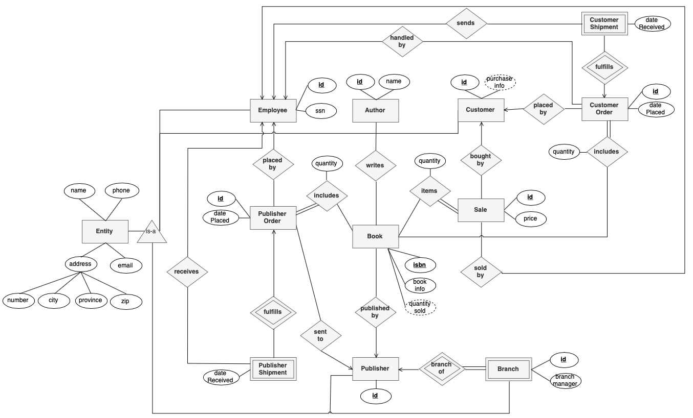
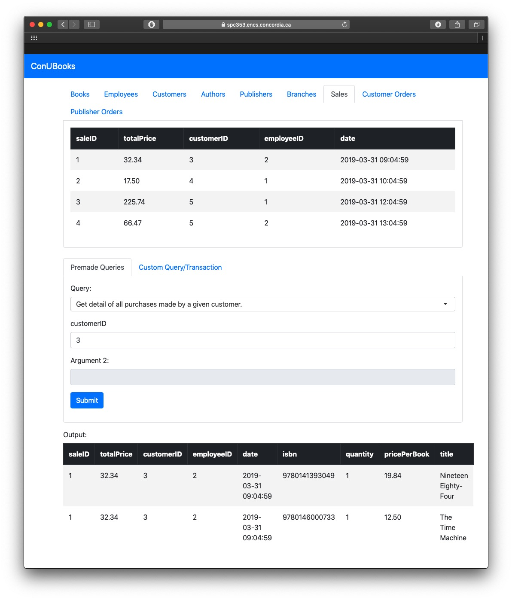

## ConUBooks - Report
#### COMP353 Section X - N. Shiri
#### Monday, April 8th 2019

Team: spc353_4

Team Representative: Patrick Spensieri

Team Email: spc353_4@encs.concordia.ca

| Name                  | ID        |
|---                    |---        |
|Andre Marques Manata   | 27148224  |
|Pablo Gonzalez         | 40003141  |
|Philippe Li            | 40005018  |
|Patrick Spensieri      | 40006417  |

---

### GitHub repository
[github.com/patrickspensieri/ConUBooks](https://github.com/patrickspensieri/ConUBooks)

If the project is still a private repository, please email **patrick.spensieri@gmail.com** for access.

#### Project URL
[spc353.encs.concordia.ca](https://spc353.encs.concordia.ca)

### Assumptions
The following assumptions were made
- Publisher and customer orders are fulfilled via a single shipment, which contains all desired books. In the event that support for multiple shipments per order is required, a `shipment_book` mapping table can be added.
- Publisher orders are sent to the publisher, who delegate to one of their branches.
- Addresses are not stored as a single string, but as entities where civic number, city, province and postal code are attributes.
- While fields like *social insurance number* could be used as a primary key, people's social insurance numbers may change, or certain employees may not have one. Thus, a generated identifier that will not change makes for a better primary key.
- The book *isbn* is the only exception, it is used as a primary key since it will never change.
- The `customerOderID` serves as the *log record* for a customer order.
- A customer's *year-to-date* purchase information is not stored as an attribute, but is gathered as a query. The same follows for a books *year-to-date* information.
- Employee transactions are recorded when an employee
    - handles a sale
    - places a publisher shipment
    - processes a customer order
    - receives a publisher shipment
    - sends out a customer shipment
- It is also assumed that requirements for queries *a.*  to *g.* must be met by using a single query. For example, consider the following requirement
    > f. Get details of all purchases made. For each customer, return the total amount paid for the books ordered since the beginning of the year.

    While this can be done with one query detailing all purchases, and another total customer expenses in a given year, it is assumed that all must be done with one query, and that books purchased must also be presented. Hence the use of joins and subqueries.

### ER Diagram
All entities that have a *name, phone number, email* and *address* extend the `entity` table.
- Allows an `employee` to make purchases and act as a `customer`.
- `address` is a composite attribute, consisting of *zip*, *civic number* and other fields
- `publisher` and `book` form a one-to-many relation, where one publisher can have many books. One-to-many relations require a mapping table, such as `book_publisher`. The primary key would be `(isbn)`.
- `author` and `book` for a many-to-many relation, where one book can have many authors. Many-to-many relations also require a mapping table, such as `author_book`. The primary key for such tables would be `(isbn, authorID)`.
- `sale` and `customer` form a one-to-one relation, in that a sale is made by a single customer. These relations do not require a mapping table.

A full resolution E/R diagram is included in the project code, under `ConUBooks/report/images/ERDiagram.png`. Else, it can be viewed [here](https://drive.google.com/file/d/1WMSZkk6wpENsKHuOdk3z7nG8eI4DbPHw/view?usp=sharing).



#### E/R Style Conversion
The E/R approach is used to convert subclass structures to relations. `customer`, `employee`, `publisher` and `branch` all borrow from the `entity` table, which has common attributes such as `name`, `phone` and `email`. The primary key of child tables such as `employee` is a foreign key to `entity`, as shown below.

```SQL
create table entity(
    entityID integer auto_increment primary key,
    name varchar(50) not null,
    ...
);

create table employee(
    employeeID integer auto_increment primary key,
    ssn integer(9) unique not null,
    foreign key (employeeID) references entity(entityID)
);
```

While this provides several advantages, creating a new entity does require more effort, since it requires writing to both the `entity` and `employee` tables, which carrying over the resulting `entityID`. Procedures such as `insertEmployee()` facilitate the process.

```SQL
CREATE PROCEDURE insertEmployee(
    IN ssn integer(9),
    IN name varchar(50),
    IN phone varchar(11),
    IN email varchar(100))
BEGIN
  INSERT INTO entity(name, phone, email) VALUES(name, phone, email);
  INSERT INTO employee VALUES(LAST_INSERT_ID(), ssn);
END //
```

#### Normalization Into BCNF
Normalization prevents several issues such as *redundancy* and *update anomalies*.
Boyce-Codd Normal Form guarantees anomalies will not be present. A relation is in BCNF if
- For any nontrivial FD *{A1 A2 An -> B1 B2 Bn}* the left side *{A1 A2 An}* must be a superkey.
- If more than one key, the left side need not contain all the keys, but only one.

All relations are in BCNF since they have at most one functional dependency, and the left side is always the key.
#### Functional Dependencies
```
entity(entityID, name, phone, email)
    entityID -> name, phone, email

address(entityID, civicNumber, city, province, postalCode)
    entityID -> civicNumber, city, province, postalCode

employee(employeeID, ssn)
    employeeID -> ssn

customer(customerID)
    none

author(authorID, name)
    authorID -> name

book(isbn, title, price, edition, quantity)
    isbn -> title, price, edition, quantity

publisher(publisherID)
    none

branch(branchID, publisherID, branchManager)
    branchID, publisherID -> branchManager

publisherOrder(publisherOrderID, employeeID, publisherID, datePlaced, dateDue)
    publisherOrderID -> employeeID, publisherID, datePlaced, dateDue

publisherShipment(publisherOrderID, employeeID, trackingNumber, dateReceived)
    publisherOrderID -> employeeID, trackingNumber, dateReceived

author_book(authorID, isbn)
    none

book_publisher(isbn, publisherID)
    isbn -> publisherID

publisherOrder_book(publisherOrderID, isbn, quantity)
    publisherOrderID, isbn -> quantity

sale(saleID, totalPrice, customerID, employeeID, date)
    saleID -> totalPrice, customerID, employeeID, date

sale_book(saleID, isbn, quantity, pricePerBook)
    saleID, isbn -> quantity, pricePerBook

customerOrder(customerOrderID, customerID, employeeID, datePlaced)
    customerOrderID -> customerID, employeeID, datePlaced

customerShipment(customerOrderID, employeeID, trackingNumber, dateReceived)
    customerOrderID -> employeeID, trackingNumber, dateReceived

customerOrder_book(customerOrderID, isbn, quantity)
    customerOrderID, isbn -> quantity
```

### Relational Database Schema
The following scripts build, populate and query the database. To run any of the scripts, establish a connection and run `source /path/to/script.sql`.

#### Schema script
The [schema.sql](https://github.com/patrickspensieri/ConUBooks/blob/master/scripts/schema.sql) script defines the schema for the database. It also defines some procedures, which facilitate insertion of subclassed entities. Cascading deletes are supported for some entities, such as branches, customer orders and publisher orders.

```SQL
-- disable foreign key checks to delete tables in any order
SET FOREIGN_KEY_CHECKS = 0;
-- drop tables
drop table if exists customerOrder_book;
drop table if exists author_book;
drop table if exists book_publisher;
drop table if exists publisherOrder_book;
drop table if exists sale_book;
drop table if exists branch;
drop table if exists publisherShipment;
drop table if exists customerShipment;
drop table if exists publisherOrder;
drop table if exists customerOrder;
drop table if exists sale;
drop table if exists employee;
drop table if exists customer;
drop table if exists author;
drop table if exists book;
drop table if exists publisher;
drop table if exists address;
drop table if exists entity;
-- drop procedures
drop procedure if exists insertEmployee;
drop procedure if exists insertCustomer;
drop procedure if exists insertPublisher;
drop procedure if exists insertBranch;
drop procedure if exists getEmployee;
drop procedure if exists getCustomer;
drop procedure if exists getPublisher;
drop procedure if exists getBranch;
-- enable foreign key checks
SET FOREIGN_KEY_CHECKS = 1;

create table entity(
    entityID integer auto_increment primary key,
    name varchar(50) not null,
    phone varchar(11) not null,
    email varchar(100)
);

create table address(
    entityID integer primary key,
    civicNumber varchar(50) not null,
    city varchar(50) not null,
    province varchar(20) not null,
    postalCode varchar(20) not null,
    foreign key (entityID) references entity(entityID) on delete cascade
);

create table employee(
    employeeID integer auto_increment primary key,
    ssn integer(9) unique not null,
    foreign key (employeeID) references entity(entityID)
);

create table customer(
    customerID integer auto_increment primary key,
    foreign key (customerID) references entity(entityID)

);

create table author(
    authorID integer auto_increment primary key,
    name varchar(50) not null
);

create table book(
    isbn char(13) primary key,
    title varchar(100) not null,
    price decimal(19,2) not null,
    edition smallint not null,
    quantity smallint not null
);

create table publisher(
    publisherID integer auto_increment primary key,
    foreign key (publisherID) references entity(entityID)
);

create table branch(
    branchID integer not null,
    publisherID integer not null,
    branchManager varchar(50) not null,
    primary key (branchID, publisherID),
    foreign key (publisherID) references publisher(publisherID),
    foreign key (branchID) references entity(entityID) on delete cascade
);

create table author_book(
    authorID integer not null,
    isbn char(13) not null,
    primary key (authorID, isbn),
    foreign key (authorID) references author(authorID),
    foreign key (isbn) references book(isbn)
);

create table book_publisher(
    isbn char(13) primary key,
    publisherID integer not null,
    foreign key (isbn) references book(isbn),
    foreign key (publisherID) references publisher(publisherID)
);

create table sale(
    saleID integer auto_increment primary key,
    totalPrice decimal(19,2) not null,
    customerID integer not null,
    employeeID integer not null,
    date datetime not null,
    foreign key (customerID) references customer(customerID),
    foreign key (employeeID) references employee(employeeID)
);

create table sale_book(
    saleID integer not null,
    isbn char(13) not null,
    quantity smallint default 1 not null,
    pricePerBook decimal(19,2) not null,
    primary key (saleID, isbn),
    foreign key (saleID) references sale(saleID),
    foreign key (isbn) references book(isbn)
);

create table publisherOrder(
    publisherOrderID integer auto_increment primary key,
    employeeID integer not null,
    publisherID integer not null,
    datePlaced datetime default current_timestamp() not null,
    dateDue datetime not null,
    foreign key (employeeID) references employee(employeeID),
    foreign key (publisherID) references publisher(publisherID)
);

create table publisherOrder_book(
    publisherOrderID integer not null,
    isbn char(13) not null,
    quantity smallint default 1 not null,
    primary key (publisherOrderID, isbn),
    foreign key (publisherOrderID) references publisherOrder(publisherOrderID) on delete cascade,
    foreign key (isbn) references book(isbn)
);

create table publisherShipment(
    publisherOrderID integer primary key,
    employeeID integer,
    trackingNumber varchar(50),
    dateReceived datetime,
    foreign key (employeeID) references employee(employeeID),
    foreign key (publisherOrderID) references publisherOrder(publisherOrderID) on delete cascade
);

create table customerOrder(
    customerOrderID integer auto_increment primary key,
    customerID integer not null,
    employeeID integer not null,
    datePlaced datetime default current_timestamp() not null,
    foreign key (customerID) references customer(customerID),
    foreign key (employeeID) references employee(employeeID)
);

create table customerOrder_book(
    customerOrderID integer not null,
    isbn char(13) not null,
    quantity smallint not null,
    primary key (customerOrderID, isbn),
    foreign key (customerOrderID) references customerOrder(customerOrderID) on delete cascade,
    foreign key (isbn) references book(isbn)
);

create table customerShipment(
    customerOrderID integer primary key,
    employeeID integer,
    trackingNumber varchar(50),
    dateReceived datetime,
    foreign key (employeeID) references employee(employeeID),
    foreign key (customerOrderID) references customerOrder(customerOrderID) on delete cascade
);

-- set the delimeter
DELIMITER //
-- insertEmployee
CREATE PROCEDURE insertEmployee(
    IN ssn integer(9),
    IN name varchar(50),
    IN phone varchar(11),
    IN email varchar(100))
BEGIN
  INSERT INTO entity(name, phone, email) VALUES(name, phone, email);
  INSERT INTO employee VALUES(LAST_INSERT_ID(), ssn);
END //
-- insertCustomer
CREATE PROCEDURE insertCustomer(
    IN name varchar(50),
    IN phone varchar(11),
    IN email varchar(100))
BEGIN
  INSERT INTO entity(name, phone, email) VALUES(name, phone, email);
  INSERT INTO customer VALUES(LAST_INSERT_ID());
END //
-- insertPublisher
CREATE PROCEDURE insertPublisher(
    IN name varchar(50),
    IN phone varchar(11),
    IN email varchar(100))
BEGIN
  INSERT INTO entity(name, phone, email) VALUES(name, phone, email);
  INSERT INTO publisher VALUES(LAST_INSERT_ID());
END //
-- insertBranch
CREATE PROCEDURE insertBranch(
    IN publisherID integer,
    IN name varchar(50),
    IN phone varchar(11),
    IN email varchar(100),
    IN branchManager varchar(50))
BEGIN
  INSERT INTO entity(name, phone, email) VALUES(name, phone, email);
  INSERT INTO branch VALUES(LAST_INSERT_ID(), publisherID, branchManager);
END //
-- getEmployee
CREATE PROCEDURE getEmployee()
BEGIN
  select employeeID, ssn, name, phone, email, civicNumber, city, province, postalCode
  from employee
  inner join entity on employeeID = entity.entityID
  inner join address on employeeID = address.entityID;
END //
-- getCustomer
CREATE PROCEDURE getCustomer()
BEGIN
  select customerID, name, phone, email, civicNumber, city, province, postalCode
  from customer
  inner join entity on customerID = entity.entityID
  inner join address on customerID = address.entityID;
END //
-- getPublisher
CREATE PROCEDURE getPublisher()
BEGIN
  select publisherID, name, phone, email, civicNumber, city, province, postalCode
  from publisher
  inner join entity on publisherID = entity.entityID
  inner join address on publisherID = address.entityID;
END //
-- getBranch
CREATE PROCEDURE getBranch()
BEGIN
  select branchID, publisherID, name, phone, email, branchManager, civicNumber, city, province, postalCode
  from branch
  inner join entity on branchID = entity.entityID
  inner join address on branchID = address.entityID;
END //
-- set delimeter back to ;
DELIMITER ;
```

#### Data script
The [data.sql](https://github.com/patrickspensieri/ConUBooks/blob/master/scripts/data.sql) script populates the tables.
```SQL
-- employee
call insertEmployee(123456789, 'Andre', '14381111111', 'andre@conubooks.com');
insert into address values (1, '1900  Lynden Road', 'Montreal', 'QC', 'L0B 1M0');
call insertEmployee(987652431, 'Philippe', '14382222222', 'philippe@conubooks.com');
insert into address values (2, '939  Nelson Street', 'Montreal', 'QC', 'P0T 2Y0');
-- customer
call insertCustomer('Pablo', '15141111111', 'pablo@yahoo.com');
insert into address values (3, '2774  Roach Road', 'Montreal', 'QC', 'N6E 1A9');
call insertCustomer('Patrick', '15142222222', 'patrick@mail.com');
insert into address values (4, '1248  rue des Champs', 'Montreal', 'QC', 'G7H 4N3');
call insertCustomer('Mario', '15143333333', 'mario@mail.com');
insert into address values (5, '1248  Random Road', 'Montreal', 'QC', 'H7L 1P3');
insert into customer values (2); -- customer who is already an employee
-- publisher
call insertPublisher('Penguin Random House', '18007333000', 'contact@randomhouse.com');
insert into address values (6, '320  Front St W', 'Toronto', 'ON', 'G7H 4N3');
call insertPublisher('Oxford University Press', '18002800280', 'contact@oxfordpress.com');
insert into address values (7, '8  Sampson Mews', 'Toronto', 'ON', 'G7L 5L9');
call insertPublisher('Vintage Books', '12129407390', 'contact@vintagebooks.com');
insert into address values (8, '1745  Broadway', 'New York', 'NY', '10019');
-- branch
call insertBranch(6, 'Penguin Random House Toronto', '14169972330', 'toronto@randomhouse.com', 'Tom Yates');
insert into address values (9, '3263  James Street', 'Toronto', 'ON', 'V5G 4W7');
-- author
insert into author values (1, 'George Orwell');
insert into author values (2, 'H. G. Wells');
insert into author values (3, 'Daniela Isac');
insert into author values (4, 'Charles Reiss');
insert into author values (5, 'Anthony Burgess');
insert into author values (6, 'Stefan Zweig');
insert into author values (7, 'Irvine Welsh');
-- book
insert into book values ('9780141393049', 'Nineteen Eighty-Four', 19.84, 1, 10);
insert into book values ('9780146000733', 'The Time Machine', 12.50, 1, 5);
insert into book values ('9780199660179', 'I-Language', 120.45, 2, 0);
insert into book values ('9780141182606', 'A Clockwork Orange', 17.50, 1, 2);
insert into book values ('9780141196305', 'Chess', 4.99, 1, 1);
insert into book values ('9780099465898', 'Trainspotting', 21.95, 1, 2);
-- author_book
insert into author_book values (1, '9780141393049');
insert into author_book values (2, '9780146000733');
insert into author_book values (3, '9780199660179');
insert into author_book values (4, '9780199660179');
insert into author_book values (5, '9780141182606');
insert into author_book values (6, '9780141196305');
insert into author_book values (7, '9780099465898');
-- book_publisher
insert into book_publisher values ('9780141393049', 6);
insert into book_publisher values ('9780146000733', 6);
insert into book_publisher values ('9780199660179', 7);
insert into book_publisher values ('9780141182606', 6);
insert into book_publisher values ('9780141196305', 6);
insert into book_publisher values ('9780099465898', 8);
-- sale
insert into sale values (1, 32.34, 3, 2, '2019-03-31 09:04:59');
insert into sale values (2, 17.50, 4, 1, '2019-03-31 10:04:59');
insert into sale values (3, 225.74, 5, 1, '2019-03-31 12:04:59');
insert into sale values (4, 66.47, 5, 2, '2019-03-31 13:04:59');
-- sale_book
insert into sale_book values (1, '9780141393049', 1, 19.84);
insert into sale_book values (1, '9780146000733', 1, 12.50);
insert into sale_book values (2, '9780141182606', 1, 17.50);
insert into sale_book values (3, '9780141393049', 1, 19.84);
insert into sale_book values (3, '9780146000733', 2, 12.50);
insert into sale_book values (3, '9780199660179', 2, 90.45);
insert into sale_book values (4, '9780141182606', 1, 17.50);
insert into sale_book values (4, '9780141196305', 1, 4.99);
insert into sale_book values (4, '9780099465898', 2, 21.95);
-- publisherOrder
insert into publisherOrder values (1, 1, 6, '2019-01-01', '2019-01-14');
insert into publisherOrder values (2, 1, 7, current_timestamp() - interval 20 day, current_timestamp() - interval 1 day);
insert into publisherOrder values (3, 2, 6, current_timestamp() - interval 100 day, current_timestamp() - interval 80 day);
-- publisherShipment
insert into publisherShipment values (1, 2, 'AA 9934 4033 AF', '2019-01-15');
insert into publisherShipment values (2, 1, null, null);
insert into publisherShipment values (3, 1, null, null);
-- pulisherOrder_book
insert into publisherOrder_book values (1, '9780141393049', 10);
insert into publisherOrder_book values (2, '9780199660179', 4);
insert into publisherOrder_book values (3, '9780141182606', 2);
insert into publisherOrder_book values (3, '9780141196305', 4);
insert into publisherOrder_book values (3, '9780141393049', 4);
insert into publisherOrder_book values (3, '9780146000733', 4);
-- customerOrder
insert into customerOrder values (1, 4, 1, current_timestamp());
insert into customerOrder values (2, 2, 2, '2019-03-31 11:04:59');
insert into customerOrder values (3, 5, 2, current_timestamp());
-- customerShipment
insert into customerShipment values (1, 1, '2349 3340 0942 3334', null);
insert into customerShipment values (2, 1, '1879 2340 0942 9998', '2019-04-04 11:04:59');
-- customerOrder_book
insert into customerOrder_book values (1, '9780199660179', 1);
insert into customerOrder_book values (2, '9780141182606', 2);
insert into customerOrder_book values (3, '9780141393049', 10);
insert into customerOrder_book values (3, '9780146000733', 10);
insert into customerOrder_book values (3, '9780199660179', 10);
insert into customerOrder_book values (3, '9780141182606', 10);
insert into customerOrder_book values (3, '9780141196305', 10);
insert into customerOrder_book values (3, '9780099465898', 10);
```

#### Queries script
The [queries.sql](https://github.com/patrickspensieri/ConUBooks/blob/master/scripts/queries.sql) script runs the five queries detailed in the handout.
```SQL
-- ASSUMPTION: Requirements a. to g. must be met using a single query, hence multiple joins and subqueries.
-- a. Get detail of all books in the Bookstore.
select *
from book;
-- b. Get detail of all books that are back order.
select p1.publisherOrderID, b.isbn, b.title, p2.quantity, p1.dateDue
from publisherOrder p1
join publisherOrder_book p2
join book b
join publisherShipment s
where p1.publisherOrderID = s.publisherOrderID
and p1.publisherOrderId = p2.publisherOrderID
and b.isbn = p2.isbn
and s.dateReceived is null;
-- c. Get detail of all the special orders for a given customer.
select c.*, cb.isbn, cb.quantity, b.title
from customerOrder c
inner join customerOrder_book cb on cb.customerOrderID = c.customerOrderID
inner join book b on cb.isbn = b.isbn
where c.customerID = 5;
-- d. Get detail of all purchases made by a given customer.
select s.*, sb.isbn, sb.quantity, sb.pricePerBook, b.title
from sale s
inner join sale_book sb on sb.saleID = s.saleID
inner join book b on sb.isbn = b.isbn
where s.customerID = 5;
-- e. Get detail of all the sales made by a given employee on a specific date.
select s.*, sb.isbn, b.title
from sale s
inner join sale_book sb on sb.saleID = s.saleID
inner join book b on sb.isbn = b.isbn
where s.employeeID = 2
and s.date between '2019-03-31' and '2019-03-31 23:59:59';
-- f. Get details of all purchases made. For each customer, return the total amount paid for the books ordered since the beginning of the year.
select s1.*, sb.isbn, (select sum(s2.totalPrice)
                from sale s2
                where s1.customerID = s2.customerID
                and s2.date between '2019-01-01' and '2019-12-31'
                group by customerID) as 'total customer sales in 2019'
from sale s1
inner join sale_book sb on sb.saleID = s1.saleID
where s1.date between '2019-01-01' and '2019-12-31';
-- g. List every book ordered but not received within the period set has passed.
select p.publisherOrderID, b.title, pb.isbn, pb.quantity, p.dateDue
from publisherOrder p
inner join publisherOrder_book pb on p.publisherOrderID = pb.publisherOrderID
inner join book b on pb.isbn = b.isbn
inner join publisherShipment s on s.publisherOrderID = p.publisherOrderID
where s.dateReceived > p.dateDue
or (s.dateReceived is null and current_timestamp() > p.dateDue);
```

#### Query output
Detailed below is the output of the `queries.sql` script seeded with the `data.sql` script. Query results can also be found [here](https://github.com/patrickspensieri/ConUBooks/blob/master/scripts/queryResults.txt) or in the project code, under `ConUBook/scripts/queryResults.txt`.


### Implemented Functionalities
Both the E/R Diagram and the database implementation meet all the requirements for the database system. The application allows employees to view and update the bookstore's database, as shown below.

Tables detailing commonly used entities such as *books*, *customers* or *publisher orders* are always present at the top of the page, offering easy access when bookstore employees reference data.


As shown below, several premade queries are included, allowing employees to quickly answer common questions. Here, the employee is inquiring about the purchases made by a given customer, and can see the results of their query.



Everything else, including making a sale, placing publisher orders and updating a customer's address can be done via the editor. The editor can be set in *query* or *transaction* mode, which allows reading or writing to the database. For convenience, templates are offered for common tasks, like placing a publisher order or seeing an author's books.


### Contribution
The first drafts of E/R diagram was developed by Andre and Patrick, later refined with feedback from both Pablo and Philippe. The E/R diagram was then made into a relational database by Andre and Patrick. Pablo and Philippe tested the first versions, providing insight on how to improve both the E/R diagram and the database implementation.

The first versions of the web application were put up by Pablo and Philippe. Andre and Patrick worked together to improve the design. ConUShop's books are inspired from Patrick's bookshelf. Pablo's cat did all the data entry.
